# Mermaid Diagram Examples for Technical Documentation

This file contains practical examples of how to use Mermaid diagrams to document various aspects of software systems.

---

## Example 1: API Request Flow Documentation

**Use Case:** Documenting how an API request flows through your system

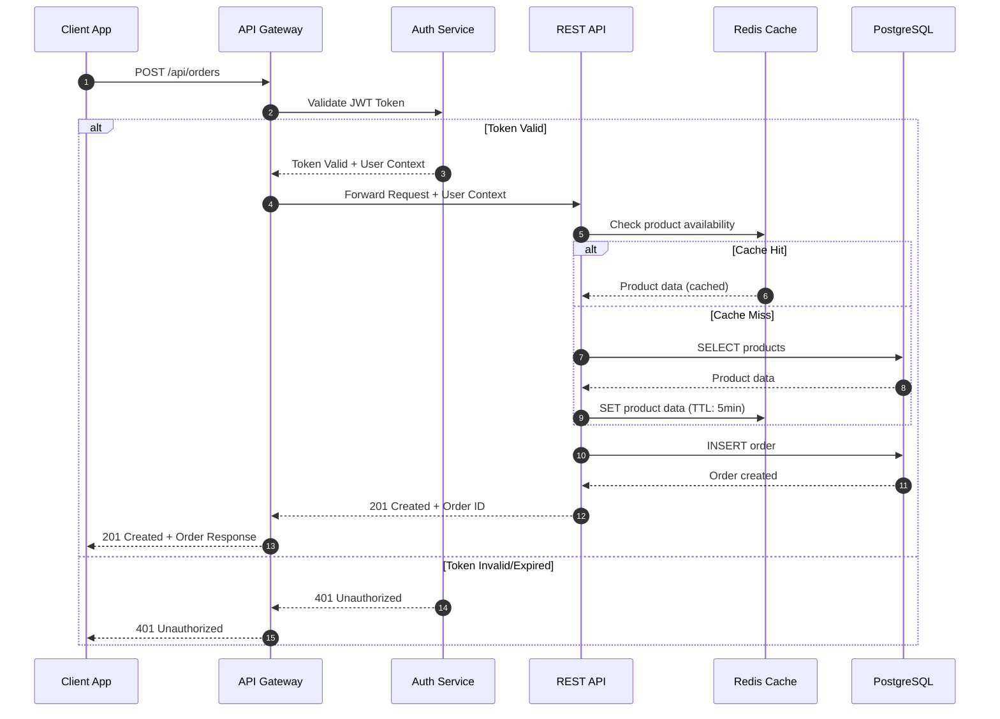

**Documentation Text:**
> The order creation flow involves authentication validation, cache lookup for product data, and database writes. The API Gateway handles all external requests and delegates authentication to the Auth Service before forwarding valid requests to the REST API.

---

## Example 2: System Architecture Overview

**Use Case:** High-level architecture documentation for README or onboarding

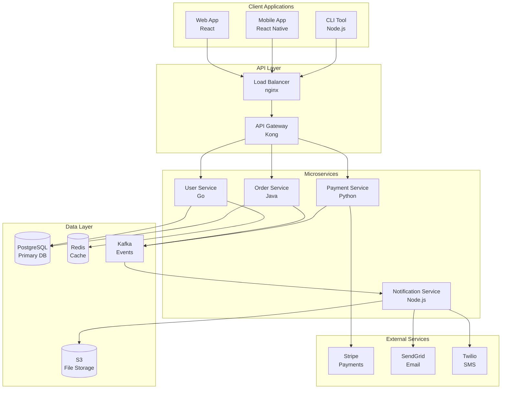

---

## Example 3: Database Schema Documentation

**Use Case:** Documenting database relationships for backend developers

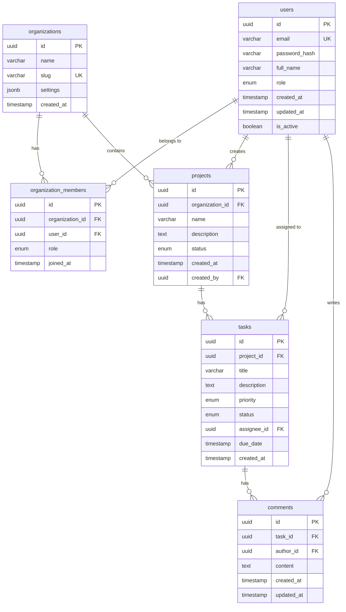

---

## Example 4: State Machine Documentation

**Use Case:** Documenting order lifecycle or workflow states

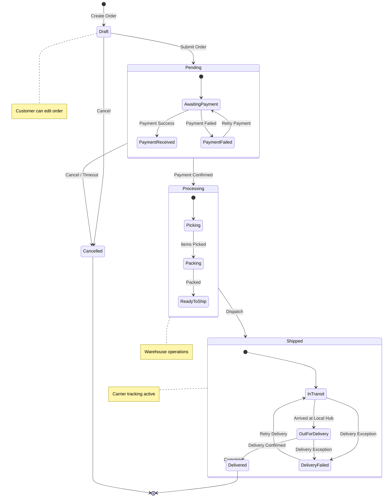

---

## Example 5: Authentication Flow

**Use Case:** Documenting OAuth2/OIDC authentication flow

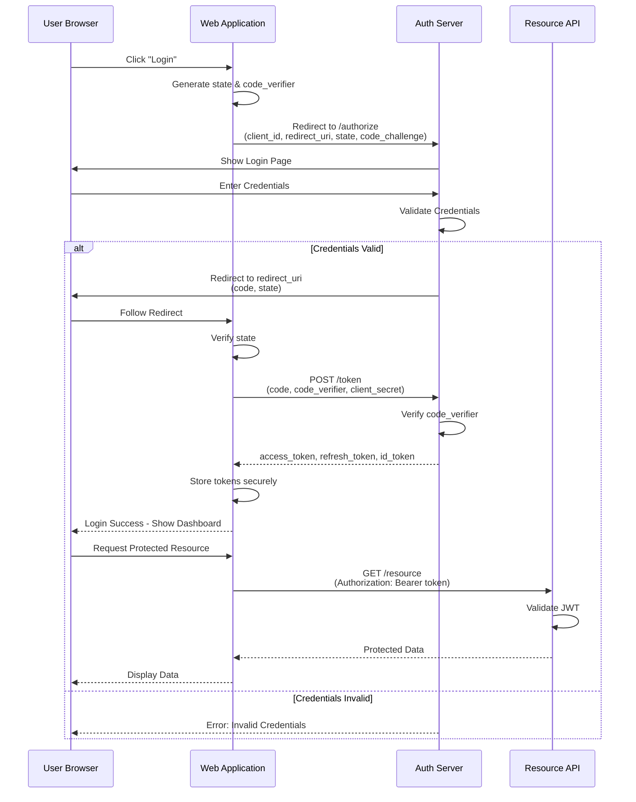

---

## Example 6: CI/CD Pipeline Documentation

**Use Case:** Documenting deployment pipeline stages

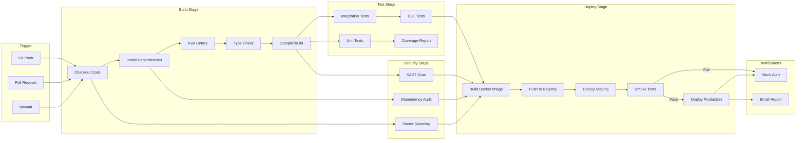

---

## Example 7: Class Diagram for Domain Model

**Use Case:** Documenting domain entities and their relationships

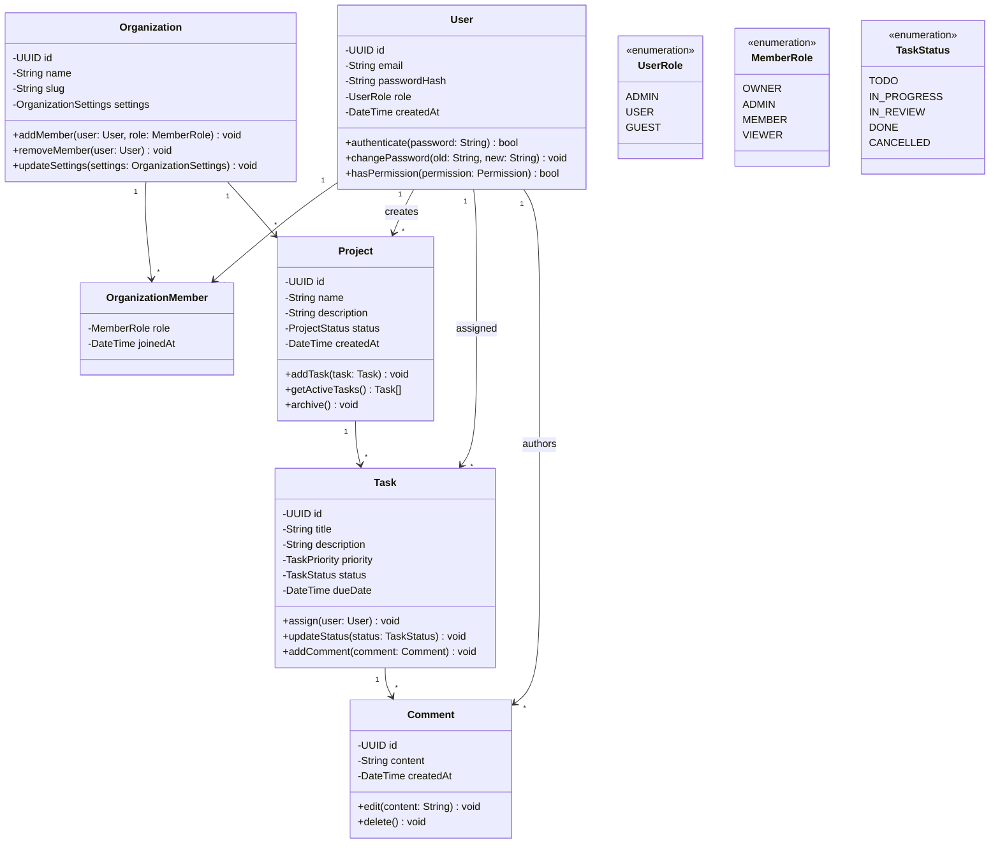

---

## Example 8: Microservices Communication

**Use Case:** Documenting service-to-service communication patterns

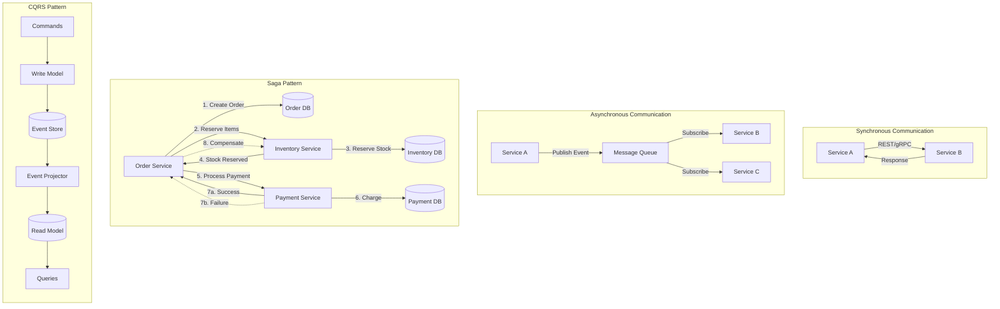

---

## Example 9: User Journey Documentation

**Use Case:** Documenting user experience for product teams

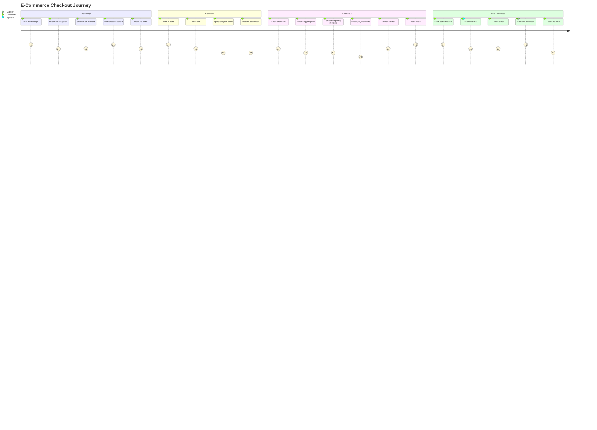

---

## Example 10: Feature Prioritization Matrix

**Use Case:** Documenting feature priority for planning

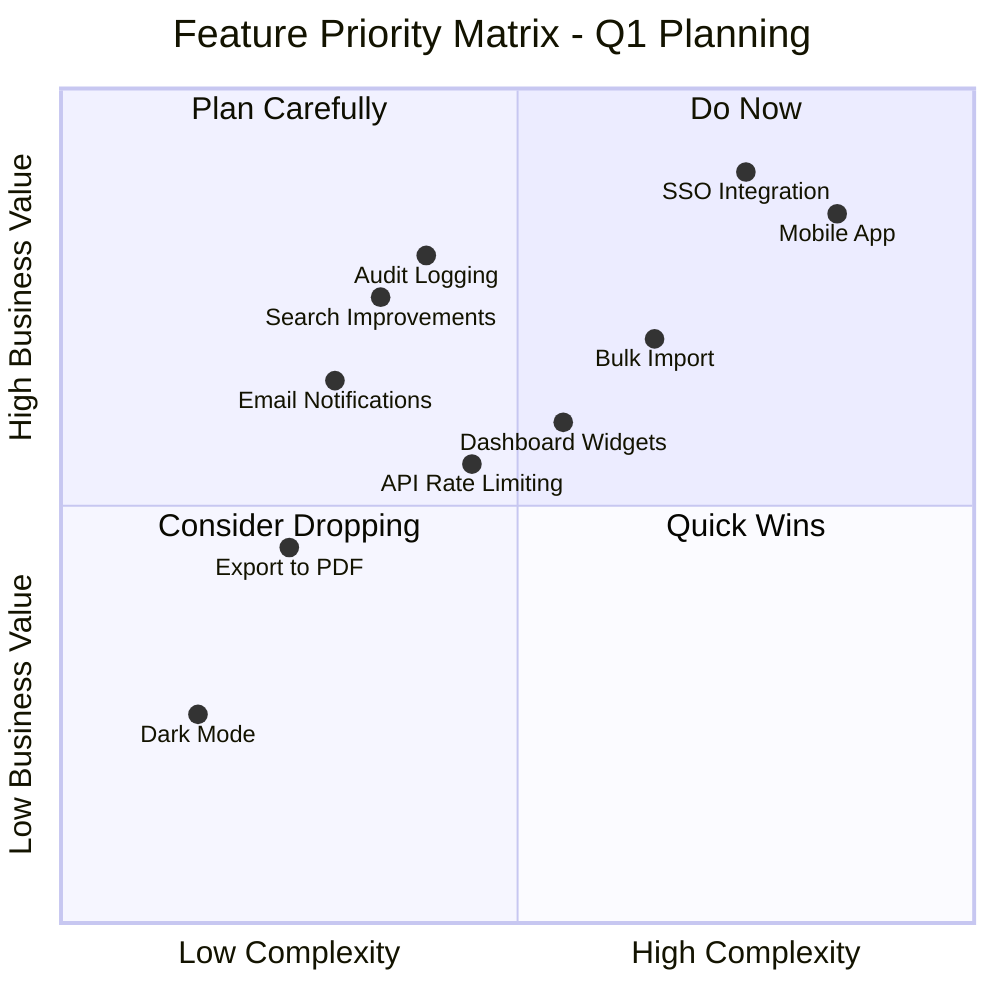

---

## Example 11: Project Timeline

**Use Case:** Documenting project milestones and phases

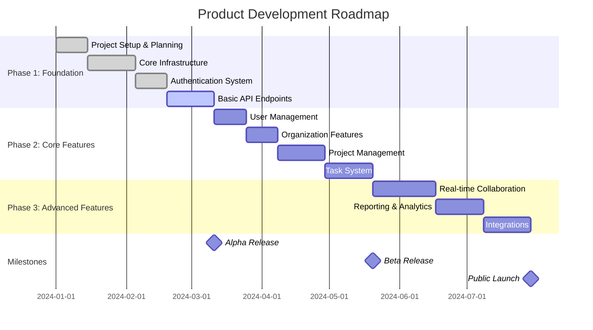

---

## Example 12: Component Hierarchy

**Use Case:** Documenting React/Vue component structure

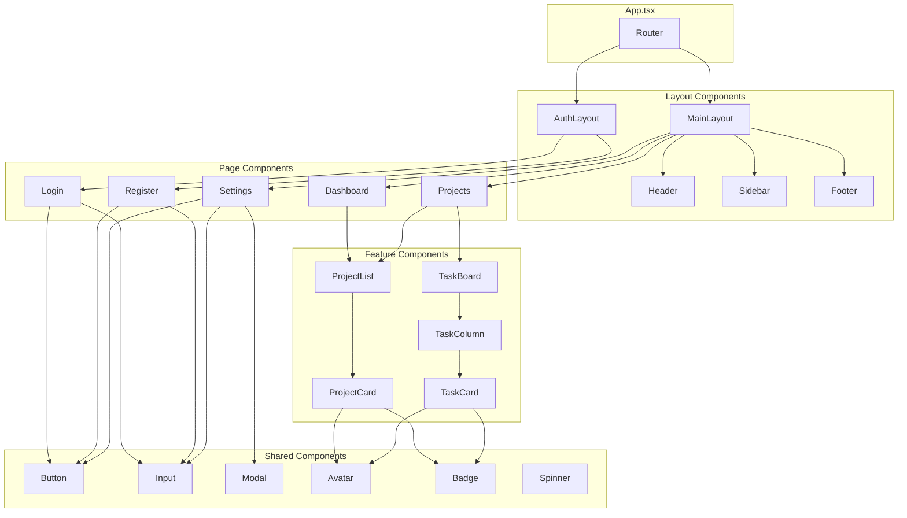

---

## Example 13: Error Handling Flow

**Use Case:** Documenting error handling strategy

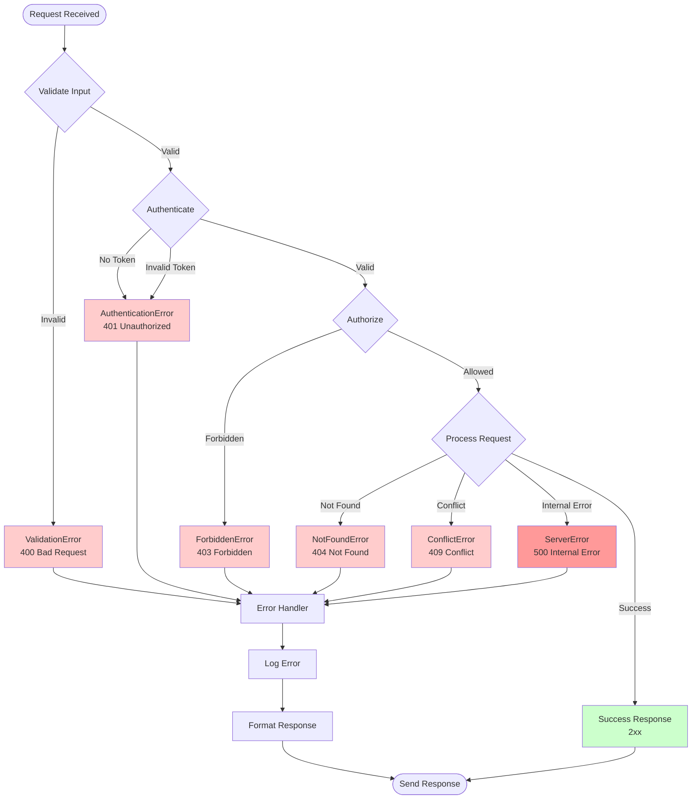

---

## Example 14: Git Branching Strategy

**Use Case:** Documenting team Git workflow

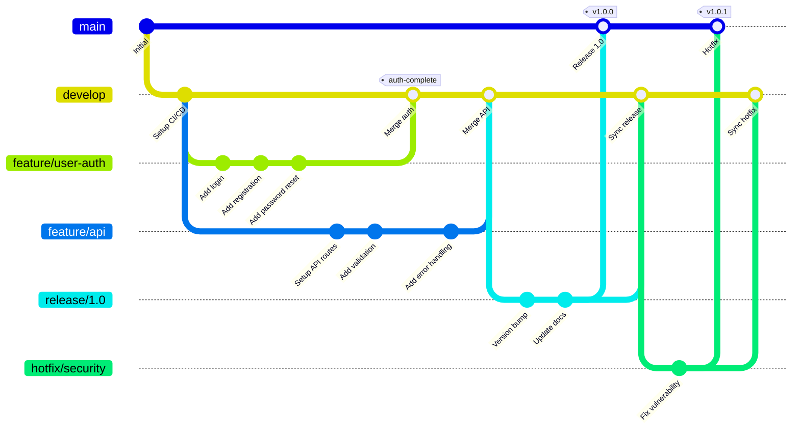

---

## Example 15: Mindmap for Technical Decisions

**Use Case:** Documenting architecture decision records (ADR)

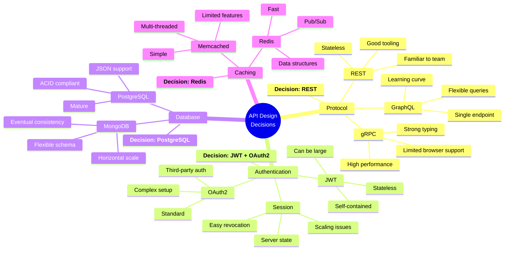

---

*These examples demonstrate how Mermaid diagrams can enhance technical documentation across different use cases. Mix and match these patterns to create comprehensive documentation for your projects.*
