# Mermaid Diagram Complete Reference Guide

This comprehensive reference guide covers all Mermaid diagram types, their syntax, and best practices for creating excellent technical documentation.

## Table of Contents

1. [Introduction to Mermaid](#introduction-to-mermaid)
2. [Flowcharts](#flowcharts)
3. [Sequence Diagrams](#sequence-diagrams)
4. [Class Diagrams](#class-diagrams)
5. [State Diagrams](#state-diagrams)
6. [Entity Relationship Diagrams](#entity-relationship-diagrams)
7. [C4 Architecture Diagrams](#c4-architecture-diagrams)
8. [User Journey Maps](#user-journey-maps)
9. [Gantt Charts](#gantt-charts)
10. [Pie Charts](#pie-charts)
11. [Mindmaps](#mindmaps)
12. [Timeline Diagrams](#timeline-diagrams)
13. [Git Graphs](#git-graphs)
14. [Quadrant Charts](#quadrant-charts)
15. [Block Diagrams](#block-diagrams)

---

## Introduction to Mermaid

Mermaid is a text-based diagramming tool that renders diagrams from markdown-like syntax. It integrates natively with GitHub, GitLab, Notion, Obsidian, and most modern documentation platforms.

### Why Use Mermaid?

- **Version Control Friendly**: Diagrams are text, making them diff-able and reviewable
- **Living Documentation**: Easy to update alongside code changes
- **No External Tools**: Renders directly in markdown files
- **Wide Platform Support**: Works in GitHub, GitLab, VS Code, and more

### Basic Structure

Every Mermaid diagram starts with a diagram type declaration:

```mermaid
diagramType
    ... diagram content ...
```

---

## Flowcharts

Flowcharts visualize processes, workflows, decision trees, and algorithms.

### Declaration and Direction

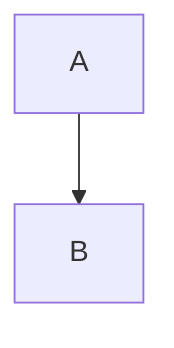

**Direction Options:**
- `TD` or `TB` - Top to Bottom
- `BT` - Bottom to Top
- `LR` - Left to Right
- `RL` - Right to Left

### Node Shapes

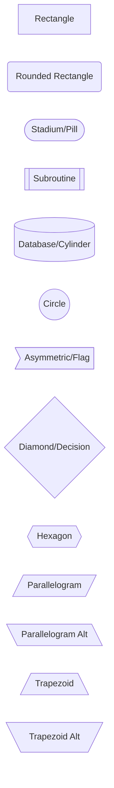

### Arrow/Edge Types

```mermaid
flowchart LR
    A --> B           %% Arrow
    B --- C           %% Line (no arrow)
    C -.-> D          %% Dotted arrow
    D ==> E           %% Thick arrow
    E --text--> F     %% Arrow with text
    F -->|text| G     %% Alternative text syntax
    G -.text.-> H     %% Dotted with text
    H ==text==> I     %% Thick with text
    I <--> J          %% Bidirectional
    J o--o K          %% Circle endpoints
    K x--x L          %% Cross endpoints
```

### Subgraphs

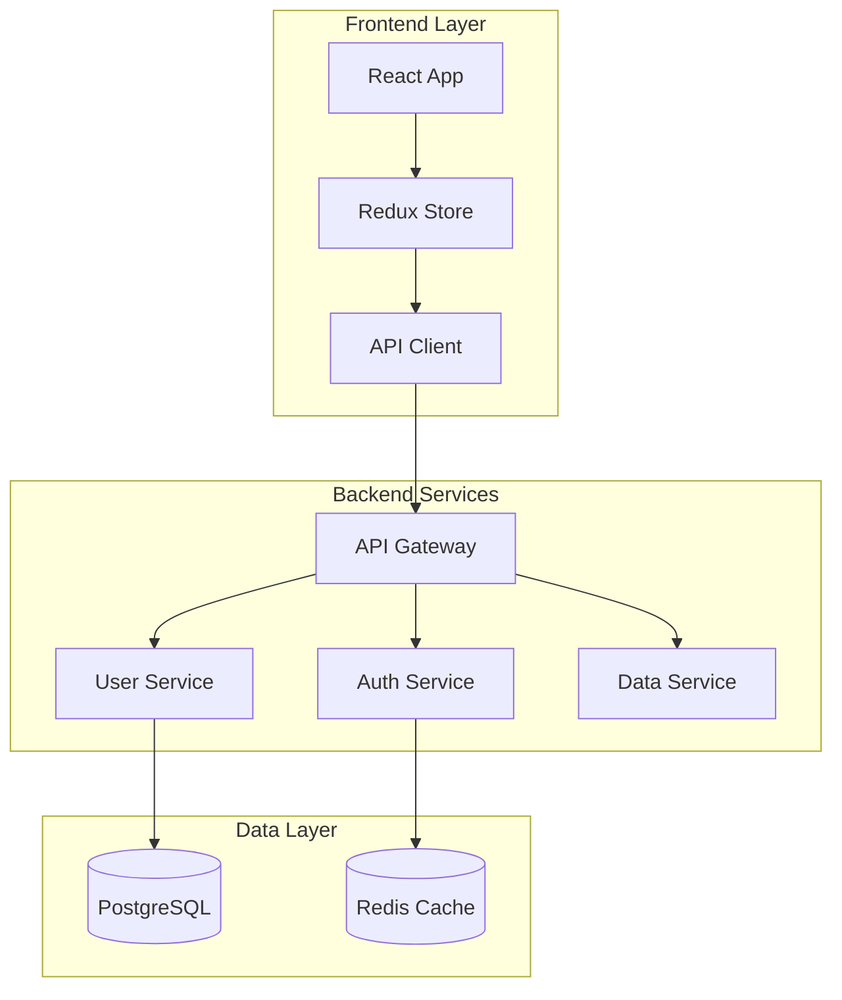

### Styling

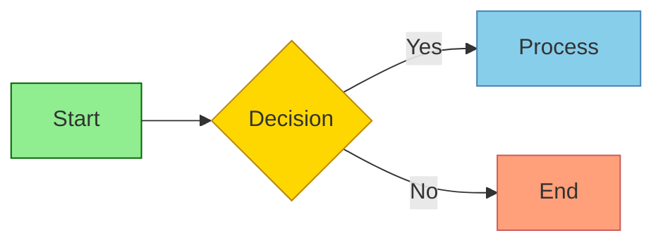

---

## Sequence Diagrams

Sequence diagrams show interactions between components/actors over time.

### Basic Syntax

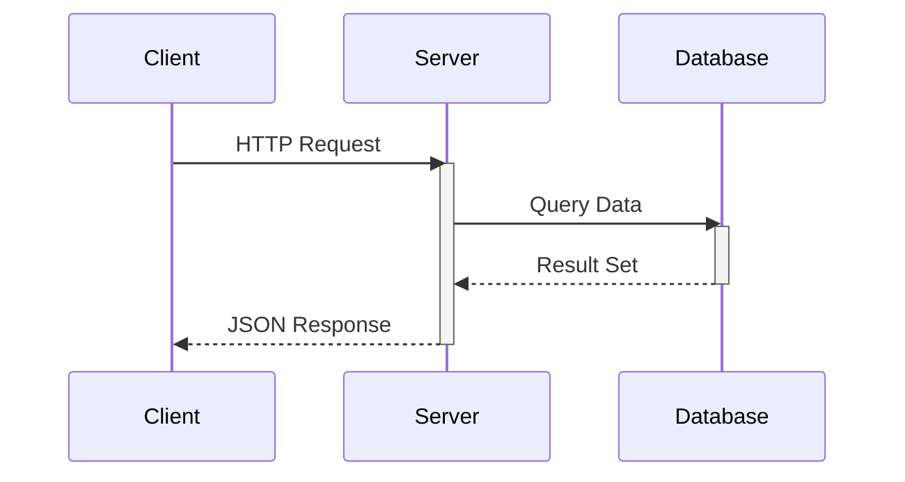

### Message Types

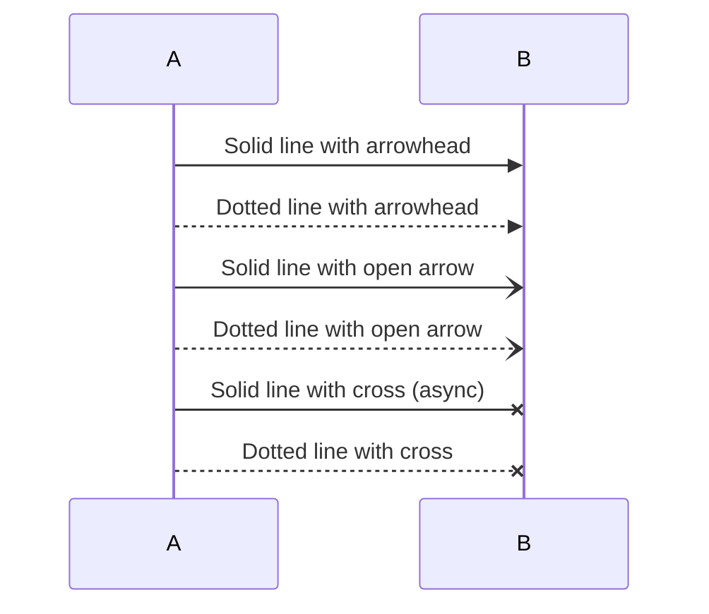

### Control Flow

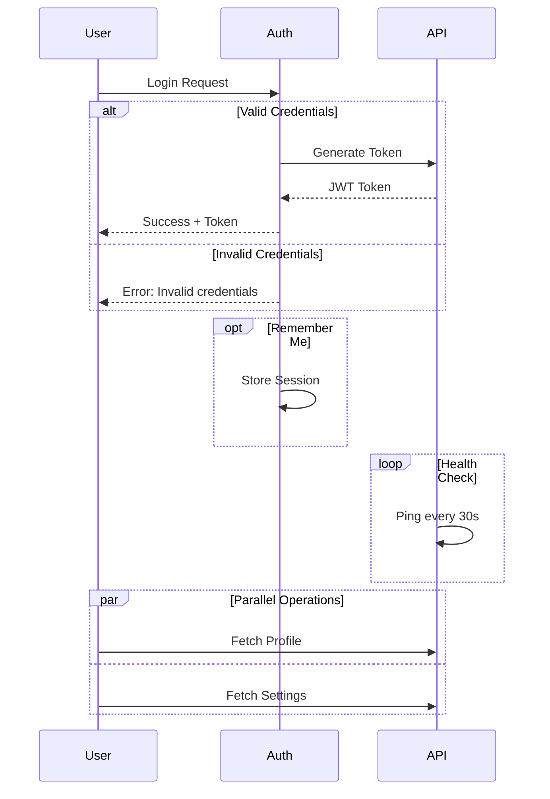

### Notes and Activation

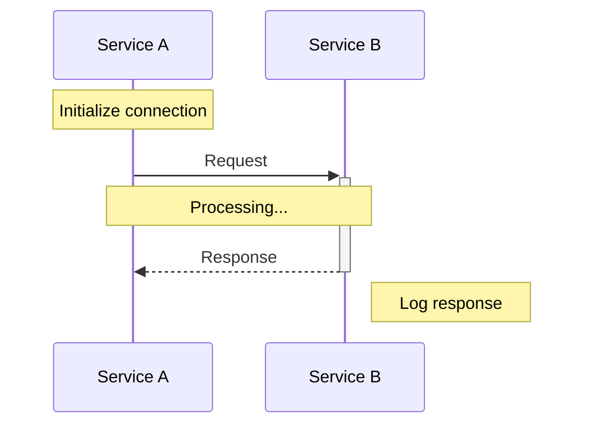

### Auto-numbering

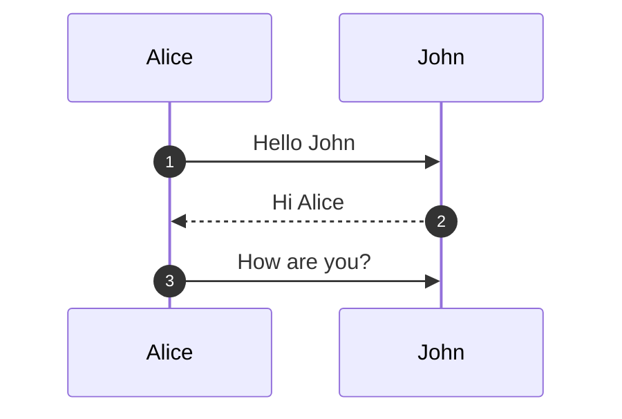

---

## Class Diagrams

Class diagrams show object-oriented structure with classes, attributes, methods, and relationships.

### Basic Class Definition

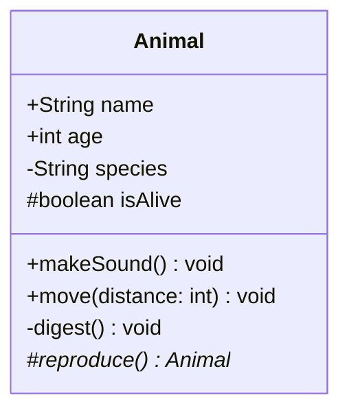

**Visibility Modifiers:**
- `+` Public
- `-` Private
- `#` Protected
- `~` Package/Internal

**Method Classifiers:**
- `*` Abstract method
- `$` Static method

### Relationships

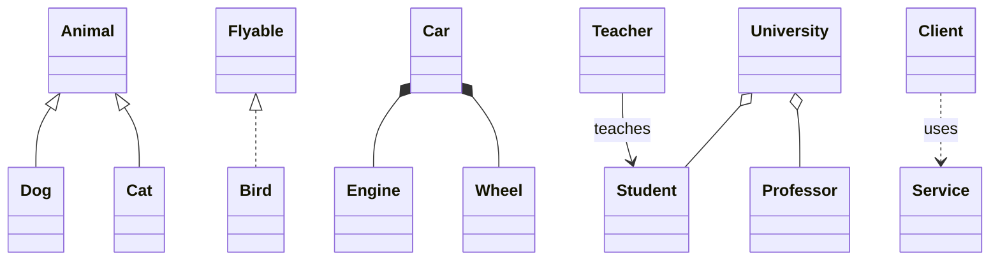

### Complete Example

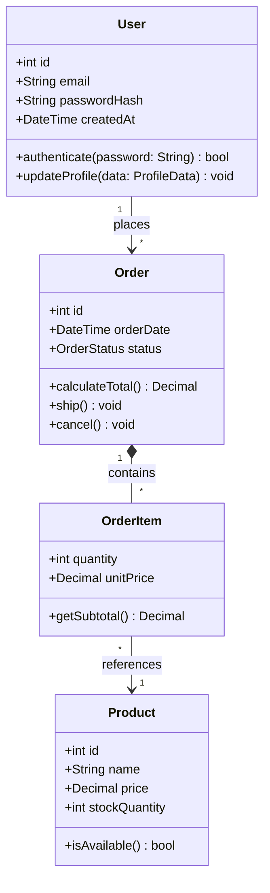

---

## State Diagrams

State diagrams model state machines and transitions.

### Basic States and Transitions

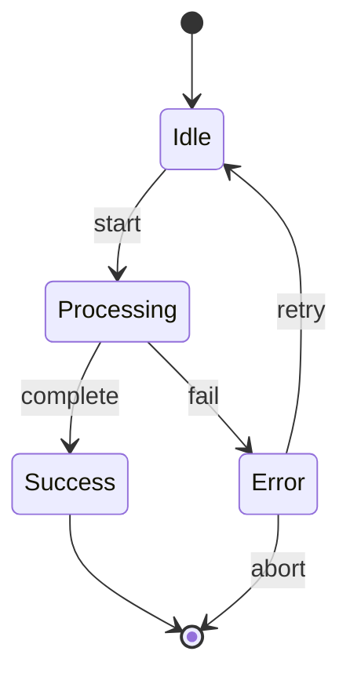

### Composite States

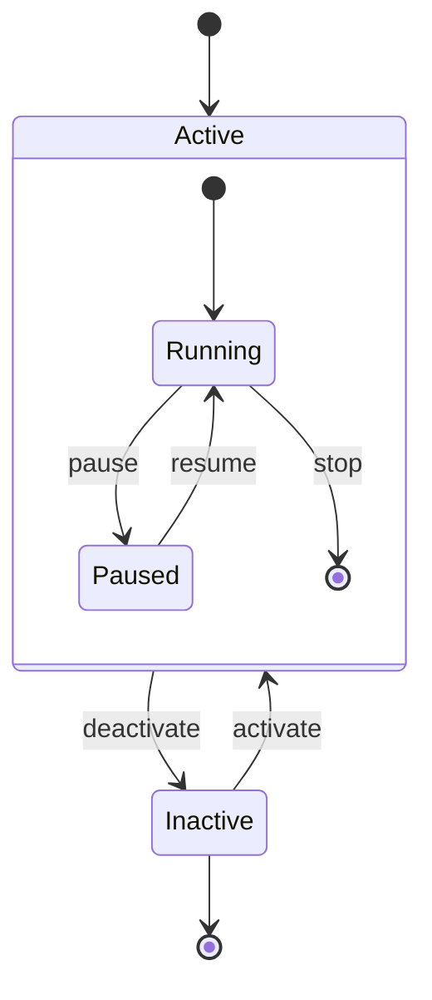

### Parallel States (Concurrent Regions)

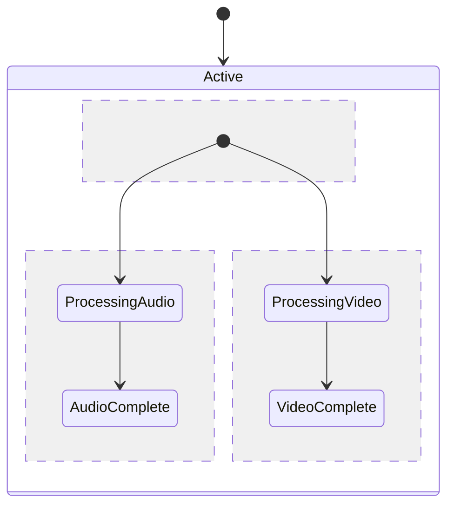

### Choice Points and Forks

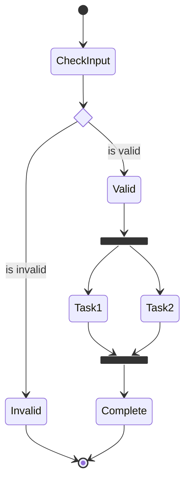

### Notes

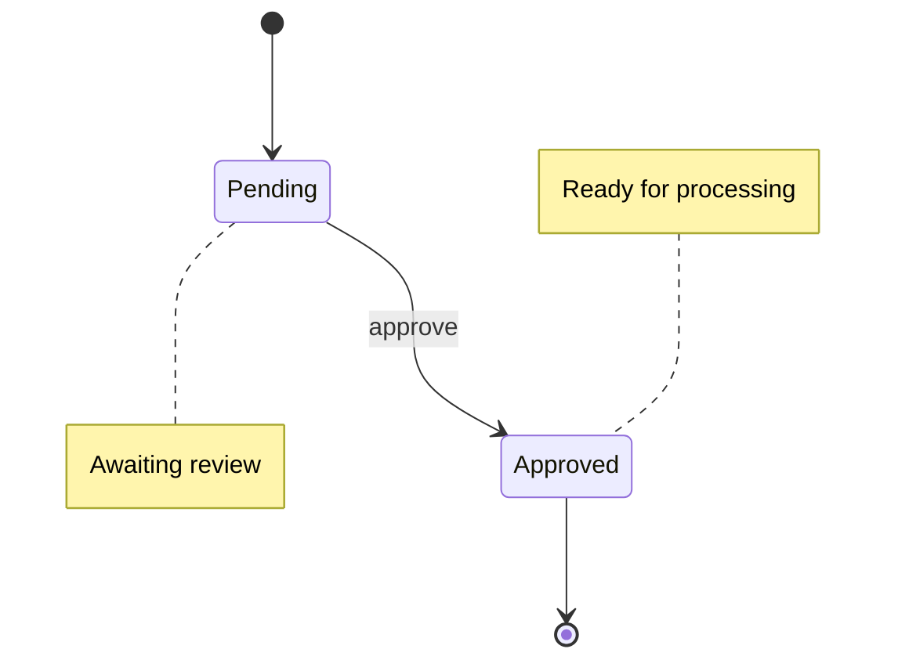

---

## Entity Relationship Diagrams

ER diagrams model database schemas and entity relationships.

### Basic Syntax

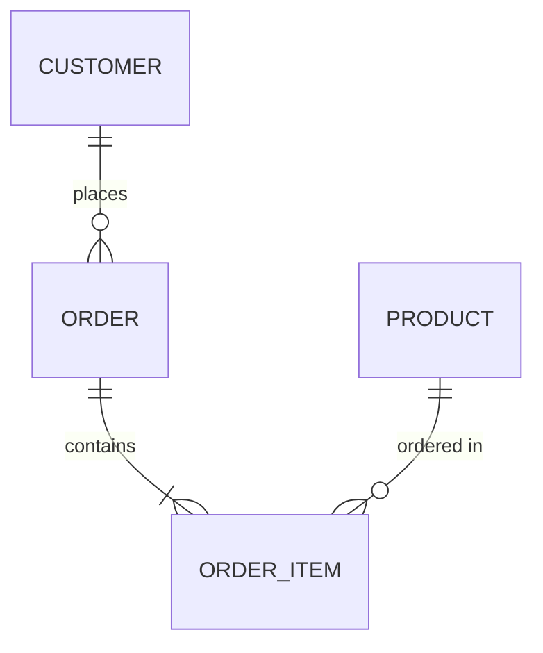

### Cardinality Notation (Crow's Foot)

```
||--||  One-to-One (exactly one)
||--o|  One-to-Zero-or-One
||--|{  One-to-One-or-More
||--o{  One-to-Zero-or-More
}|--|{  One-or-More to One-or-More
}o--o{  Zero-or-More to Zero-or-More
```

**Symbols:**
- `|` - Exactly one
- `o` - Zero or one
- `{` - One or more
- `}` - Zero or more

### Entities with Attributes

```mermaid
erDiagram
    USER {
        int id PK
        string email UK
        string password_hash
        datetime created_at
        datetime updated_at
    }

    POST {
        int id PK
        int user_id FK
        string title
        text content
        enum status
        datetime published_at
    }

    COMMENT {
        int id PK
        int post_id FK
        int user_id FK
        text body
        datetime created_at
    }

    USER ||--o{ POST : writes
    USER ||--o{ COMMENT : makes
    POST ||--o{ COMMENT : has
```

**Attribute Keys:**
- `PK` - Primary Key
- `FK` - Foreign Key
- `UK` - Unique Key

### Identifying vs Non-Identifying Relationships

```mermaid
erDiagram
    %% Identifying (solid line) - child can't exist without parent
    ORDER ||--|{ ORDER_LINE : contains

    %% Non-identifying (dashed line) - both can exist independently
    PERSON }|..|{ CAR : drives
```

---

## C4 Architecture Diagrams

C4 diagrams model software architecture at different abstraction levels.

### System Context Diagram (C4Context)

```mermaid
C4Context
    title System Context Diagram - E-Commerce Platform

    Person(customer, "Customer", "A user who browses and purchases products")
    Person(admin, "Admin", "Manages products and orders")

    System(ecommerce, "E-Commerce Platform", "Allows customers to browse, purchase products")

    System_Ext(payment, "Payment Gateway", "Processes credit card payments")
    System_Ext(shipping, "Shipping Provider", "Handles order fulfillment")
    System_Ext(email, "Email Service", "Sends transactional emails")

    Rel(customer, ecommerce, "Uses", "HTTPS")
    Rel(admin, ecommerce, "Manages", "HTTPS")
    Rel(ecommerce, payment, "Processes payments", "API")
    Rel(ecommerce, shipping, "Ships orders", "API")
    Rel(ecommerce, email, "Sends emails", "SMTP")
```

### Container Diagram (C4Container)

```mermaid
C4Container
    title Container Diagram - E-Commerce Platform

    Person(customer, "Customer", "A user who purchases products")

    System_Boundary(ecommerce, "E-Commerce Platform") {
        Container(web, "Web Application", "React", "Serves the SPA to customers")
        Container(api, "API Gateway", "Node.js", "Routes and authenticates requests")
        Container(catalog, "Catalog Service", "Python", "Manages product catalog")
        Container(orders, "Order Service", "Java", "Handles order processing")
        ContainerDb(db, "Database", "PostgreSQL", "Stores all application data")
        ContainerDb(cache, "Cache", "Redis", "Caches frequent queries")
    }

    System_Ext(payment, "Payment Gateway", "Stripe")

    Rel(customer, web, "Uses", "HTTPS")
    Rel(web, api, "Calls", "JSON/HTTPS")
    Rel(api, catalog, "Reads", "gRPC")
    Rel(api, orders, "Writes", "gRPC")
    Rel(catalog, db, "Reads/Writes", "SQL")
    Rel(orders, db, "Reads/Writes", "SQL")
    Rel(catalog, cache, "Reads/Writes")
    Rel(orders, payment, "Processes", "API")
```

### Component Diagram (C4Component)

```mermaid
C4Component
    title Component Diagram - Order Service

    Container_Boundary(orders, "Order Service") {
        Component(controller, "Order Controller", "Spring MVC", "Handles HTTP requests")
        Component(service, "Order Service", "Spring Bean", "Business logic")
        Component(repo, "Order Repository", "JPA", "Data access")
        Component(events, "Event Publisher", "Kafka Client", "Publishes domain events")
    }

    ContainerDb(db, "Database", "PostgreSQL")
    Container(kafka, "Message Broker", "Kafka")

    Rel(controller, service, "Uses")
    Rel(service, repo, "Uses")
    Rel(service, events, "Publishes to")
    Rel(repo, db, "Reads/Writes")
    Rel(events, kafka, "Sends events")
```

---

## User Journey Maps

User journey diagrams visualize user experiences across touchpoints.

```mermaid
journey
    title My Working Day
    section Morning
        Wake up: 3: Me
        Shower: 4: Me
        Breakfast: 5: Me, Family
        Commute: 2: Me
    section Work
        Check emails: 3: Me
        Team standup: 4: Me, Team
        Deep work: 5: Me
        Lunch: 4: Me, Colleagues
        Meetings: 2: Me, Team
    section Evening
        Commute home: 2: Me
        Dinner: 5: Me, Family
        Relaxation: 5: Me
```

**Score Scale:** 1 (worst) to 5 (best)

---

## Gantt Charts

Gantt charts visualize project schedules and timelines.

```mermaid
gantt
    title Project Development Timeline
    dateFormat YYYY-MM-DD

    section Planning
        Requirements gathering    :a1, 2024-01-01, 14d
        Architecture design       :a2, after a1, 10d
        Technical specification   :a3, after a1, 7d

    section Development
        Backend development       :b1, after a2, 30d
        Frontend development      :b2, after a3, 25d
        API integration          :b3, after b1, 10d

    section Testing
        Unit testing             :c1, after b1, 15d
        Integration testing      :c2, after b3, 10d
        UAT                      :c3, after c2, 7d

    section Deployment
        Staging deployment       :d1, after c2, 3d
        Production deployment    :milestone, d2, after c3, 1d
```

### Task Status Markers

```mermaid
gantt
    title Task Status Examples
    dateFormat YYYY-MM-DD

    Completed task        :done, t1, 2024-01-01, 5d
    Active task           :active, t2, after t1, 5d
    Future task           :t3, after t2, 5d
    Critical task         :crit, t4, after t3, 3d
    Milestone             :milestone, m1, after t4, 0d
```

---

## Pie Charts

Pie charts show proportional data distribution.

```mermaid
pie showData
    title Technology Stack Distribution
    "JavaScript" : 35
    "Python" : 25
    "Go" : 20
    "Rust" : 12
    "Other" : 8
```

---

## Mindmaps

Mindmaps organize hierarchical information visually.

```mermaid
mindmap
    root((Software Architecture))
        Frontend
            React
            Vue
            Angular
            State Management
                Redux
                MobX
                Zustand
        Backend
            Languages
                Node.js
                Python
                Go
                Java
            Frameworks
                Express
                FastAPI
                Gin
                Spring Boot
        Database
            SQL
                PostgreSQL
                MySQL
            NoSQL
                MongoDB
                Redis
                Cassandra
        DevOps
            CI/CD
                GitHub Actions
                Jenkins
                GitLab CI
            Infrastructure
                Kubernetes
                Docker
                Terraform
```

---

## Timeline Diagrams

Timeline diagrams show chronological events.

```mermaid
timeline
    title Project Milestones
    section Q1 2024
        January : Project kickoff
                : Team formation
        February : Requirements complete
                 : Design approved
        March : MVP development starts
    section Q2 2024
        April : Alpha release
        May : Beta testing
            : Bug fixes
        June : Production release
    section Q3 2024
        July : Feature expansion
        August : Performance optimization
        September : V2.0 planning
```

---

## Git Graphs

Git graphs visualize branching and merging strategies.

```mermaid
gitGraph
    commit id: "Initial commit"
    branch develop
    checkout develop
    commit id: "Setup project"
    commit id: "Add base structure"
    branch feature/auth
    checkout feature/auth
    commit id: "Add login"
    commit id: "Add registration"
    checkout develop
    merge feature/auth id: "Merge auth feature"
    branch feature/api
    checkout feature/api
    commit id: "Create endpoints"
    commit id: "Add validation"
    checkout develop
    merge feature/api id: "Merge API feature"
    checkout main
    merge develop id: "Release v1.0" tag: "v1.0"
```

---

## Quadrant Charts

Quadrant charts position items across two axes for prioritization.

```mermaid
quadrantChart
    title Feature Prioritization Matrix
    x-axis Low Effort --> High Effort
    y-axis Low Impact --> High Impact

    quadrant-1 Do First
    quadrant-2 Plan Carefully
    quadrant-3 Delegate or Drop
    quadrant-4 Quick Wins

    User Authentication: [0.8, 0.9]
    Search Feature: [0.3, 0.8]
    Dark Mode: [0.2, 0.3]
    Analytics Dashboard: [0.7, 0.7]
    Email Notifications: [0.4, 0.5]
    Export to PDF: [0.5, 0.4]
```

---

## Block Diagrams

Block diagrams create grid-based layouts for system visualization.

```mermaid
block-beta
    columns 3

    Frontend["Frontend\nReact App"]:1
    API["API Gateway"]:1
    Services["Microservices"]:1

    space:1
    Auth["Auth\nService"]:1
    space:1

    DB[("PostgreSQL")]:1
    Cache[("Redis")]:1
    Queue[("RabbitMQ")]:1

    Frontend --> API
    API --> Auth
    API --> Services
    Services --> DB
    Services --> Cache
    Services --> Queue
```

---

## Best Practices Summary

### 1. Keep It Simple
- Start with the minimum elements needed
- Add complexity only when necessary
- Break large diagrams into smaller focused ones

### 2. Use Consistent Styling
- Maintain the same shapes for similar concepts
- Use consistent colors for categories
- Keep labeling style uniform

### 3. Choose the Right Diagram Type
- **Flowcharts**: Processes, decisions, workflows
- **Sequence**: API calls, service interactions, protocols
- **Class**: Object-oriented design, type relationships
- **State**: Lifecycle, state machines, transitions
- **ER**: Database schemas, data models
- **C4**: Software architecture at various zoom levels
- **Gantt**: Project timelines, schedules
- **Journey**: User experience, touchpoints

### 4. Label Everything Clearly
- Use descriptive names, not abbreviations
- Add relationship labels when not obvious
- Include notes for complex logic

### 5. Direction and Layout
- Choose direction based on reading flow (LR for timelines, TB for hierarchies)
- Use subgraphs to group related elements
- Position important elements prominently

### 6. Version Control
- Keep diagrams in code repositories
- Update diagrams when code changes
- Review diagram changes in PRs

---

## Platform Support

Mermaid diagrams render automatically in:
- **GitHub** - Markdown files and comments
- **GitLab** - Markdown files and wikis
- **Notion** - Code blocks with mermaid language
- **Obsidian** - Native support
- **VS Code** - With Markdown Preview Enhanced
- **Confluence** - With Mermaid plugin
- **Docusaurus** - Native support
- **MkDocs** - With mermaid2 plugin

---

## Common Troubleshooting

### Reserved Words
Avoid using `end` as a node ID in lowercase. Use `End`, `END`, or wrap in quotes.

### Special Characters
Escape special characters or wrap text in quotes:
```mermaid
flowchart LR
    A["Node with (parentheses)"]
    B["Node with [brackets]"]
```

### Long Labels
Use markdown strings for formatting:
```mermaid
flowchart LR
    A["`**Bold** and
    _italic_ text`"]
```

---

*This reference is part of the docs-with-mermaid Claude Code skill.*
