# How to Make Technical Documentation Simpler with Mermaid Diagrams

## A Complete Guide

Technical documentation is often dense, hard to follow, and quickly outdated. This guide shows you how to use Mermaid diagrams to create documentation that is visual, maintainable, and genuinely helpful.

---

## Table of Contents

1. [The Problem with Traditional Documentation](#the-problem-with-traditional-documentation)
2. [Why Mermaid Solves These Problems](#why-mermaid-solves-these-problems)
3. [Understanding Your Audience](#understanding-your-audience)
4. [Choosing the Right Diagram](#choosing-the-right-diagram)
5. [Documentation Patterns](#documentation-patterns)
6. [Step-by-Step Process](#step-by-step-process)
7. [Common Mistakes to Avoid](#common-mistakes-to-avoid)
8. [Advanced Techniques](#advanced-techniques)

---

## The Problem with Traditional Documentation

### 1. Walls of Text

Traditional documentation often looks like this:

> "The user submits a login request to the frontend application, which then forwards the credentials to the authentication service. The authentication service validates the credentials against the user database. If valid, it generates a JWT token and returns it to the frontend. The frontend stores the token and includes it in subsequent API requests. The API gateway validates the token before forwarding requests to backend services."

**The Problem**: This paragraph requires significant mental effort to visualize. Readers must construct a mental model while reading.

### 2. Outdated Diagrams

Image-based diagrams (created in Visio, Lucidchart, etc.) become outdated because:
- They require opening external tools to edit
- They're stored separately from code
- Changes aren't tracked in version control
- Nobody remembers who has the source file

### 3. Inconsistent Representations

Without standards, each team member creates diagrams differently:
- Different shapes for the same concepts
- Inconsistent arrow directions
- Varying levels of detail
- Clashing color schemes

---

## Why Mermaid Solves These Problems

### 1. Diagrams as Code

Mermaid diagrams are plain text that renders as visual diagrams:

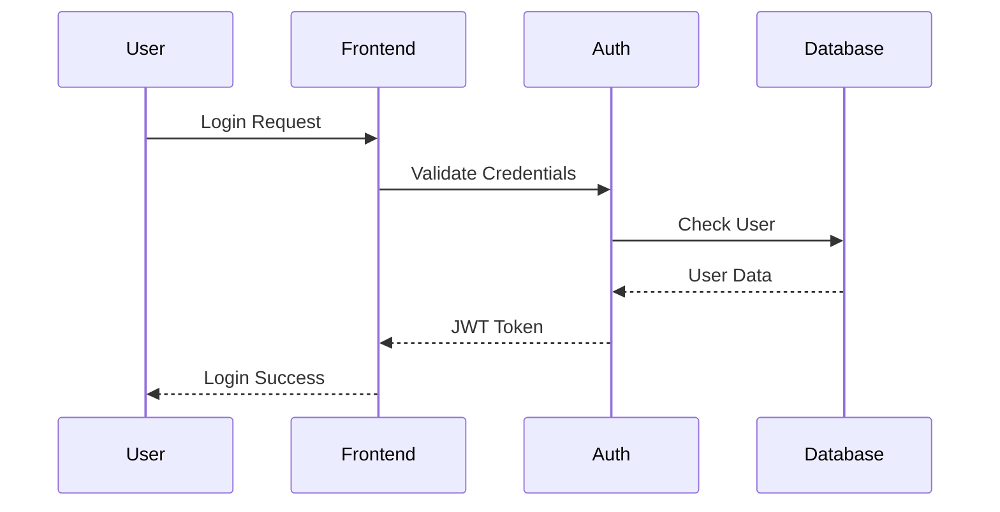

**Benefits**:
- Lives alongside your code
- Version controlled with Git
- Reviewable in pull requests
- No external tools needed

### 2. Platform Native

Mermaid renders automatically in:
- GitHub markdown files
- GitLab documentation
- Notion pages
- Most modern documentation platforms

No image exports, no broken links, no missing files.

### 3. Consistent by Design

Mermaid enforces consistent styling:
- Standard shapes for each element type
- Automatic layout and spacing
- Built-in color themes
- Predictable output

---

## Understanding Your Audience

Before creating documentation, understand who will read it:

### New Developers (Onboarding)

**Need**: High-level understanding of how things connect

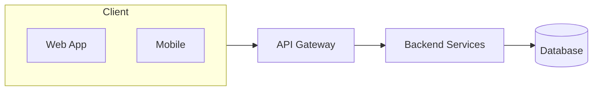

**Guidelines**:
- Keep it simple (5-10 boxes maximum)
- Show major components only
- Emphasize relationships over details

### Senior Engineers (Architecture)

**Need**: Technical details and edge cases

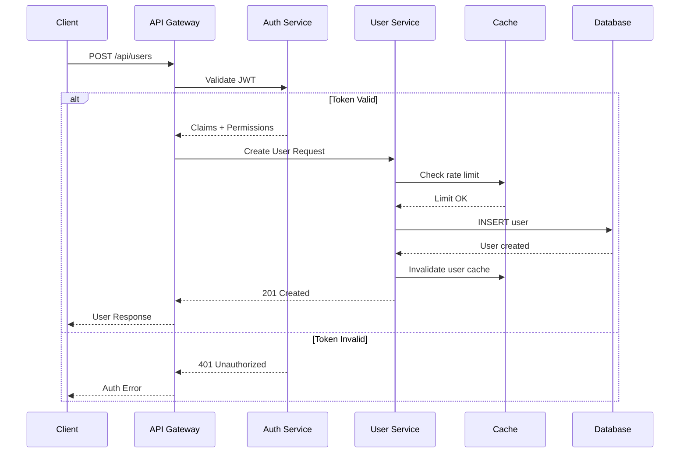

**Guidelines**:
- Include error handling paths
- Show caching and optimization
- Detail the full flow including edge cases

### Product/Business Stakeholders

**Need**: Understanding of user impact and business flow

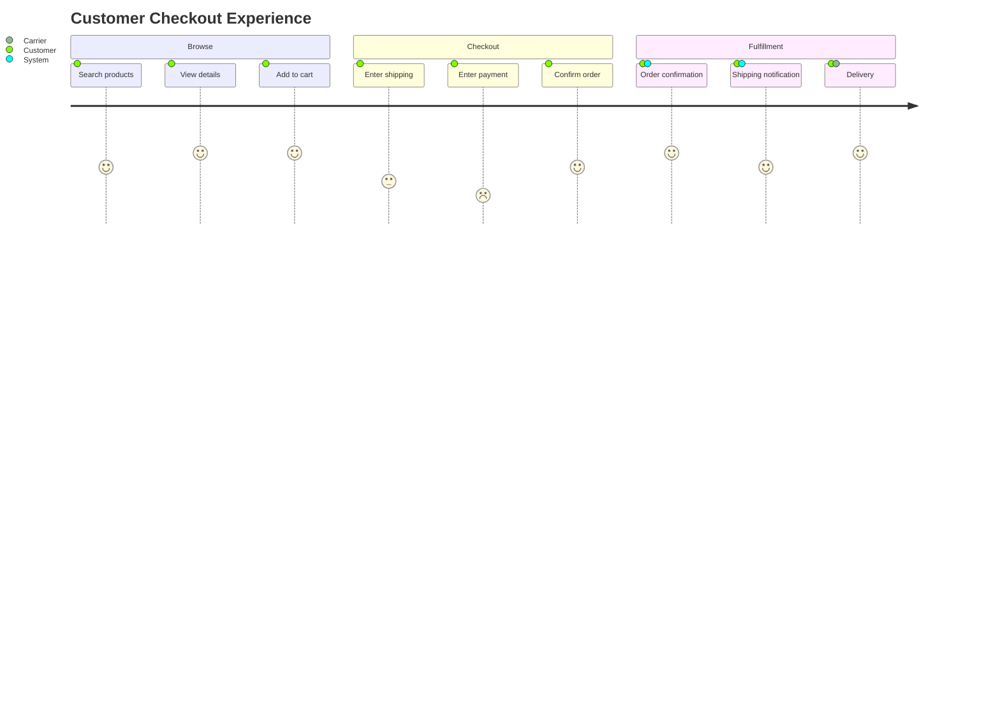

**Guidelines**:
- Focus on user experience
- Show emotional journey (satisfaction scores)
- Avoid technical jargon

---

## Choosing the Right Diagram

### Decision Guide

Ask yourself: **What question is this documentation answering?**

| Question | Diagram Type |
|----------|--------------|
| "How does data flow through the system?" | Sequence Diagram |
| "What are the components and how do they connect?" | Flowchart or C4 Diagram |
| "What states can this entity be in?" | State Diagram |
| "What's the data model?" | ER Diagram |
| "How are the classes/types structured?" | Class Diagram |
| "What's the project timeline?" | Gantt Chart |
| "What does the user experience look like?" | User Journey |
| "How should we prioritize features?" | Quadrant Chart |

### Diagram Type Deep Dive

#### Flowcharts: Process and Logic

**Best for**: Decision trees, algorithms, business processes, approval workflows

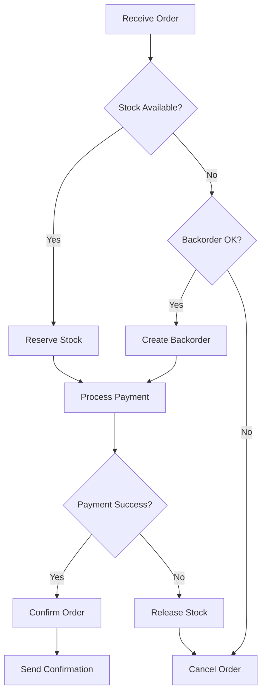

**When NOT to use**: Time-based interactions (use sequence diagrams instead)

#### Sequence Diagrams: Interactions Over Time

**Best for**: API documentation, service communication, protocol flows

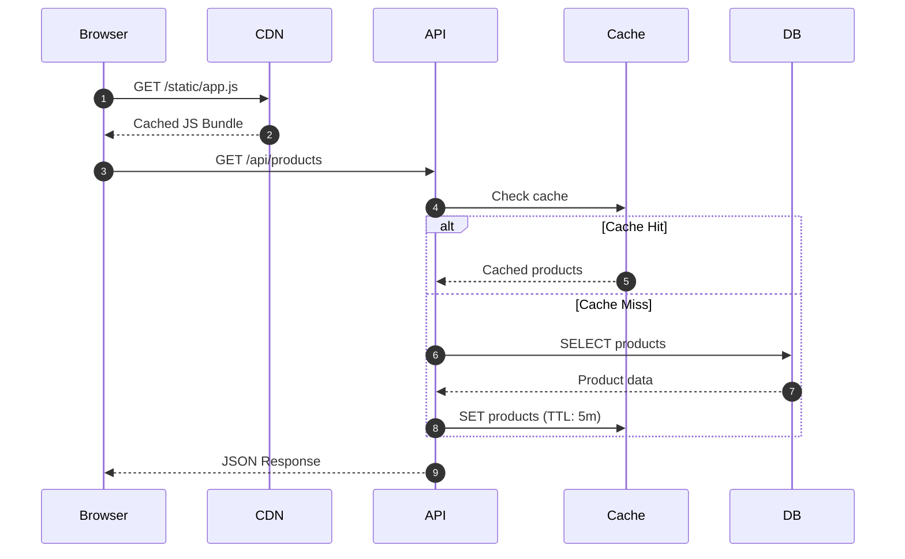

**When NOT to use**: Static structure (use flowcharts or class diagrams)

#### State Diagrams: Lifecycle Management

**Best for**: Order status, user account states, workflow stages

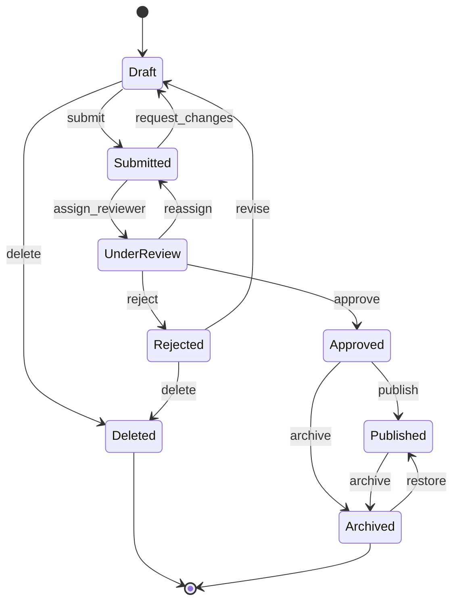

**When NOT to use**: Simple linear processes (use flowcharts)

#### ER Diagrams: Data Models

**Best for**: Database documentation, API response structures

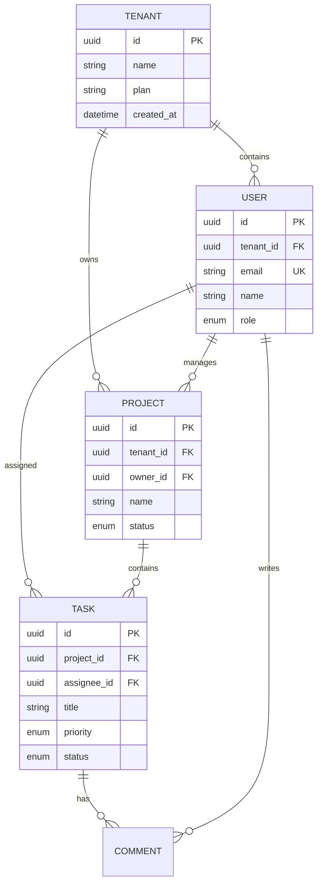

**When NOT to use**: Showing behavior (use sequence or state diagrams)

#### C4 Diagrams: Architecture at Scale

Use the C4 model to zoom in and out of your architecture:

**Level 1 - Context**: Your system and its environment

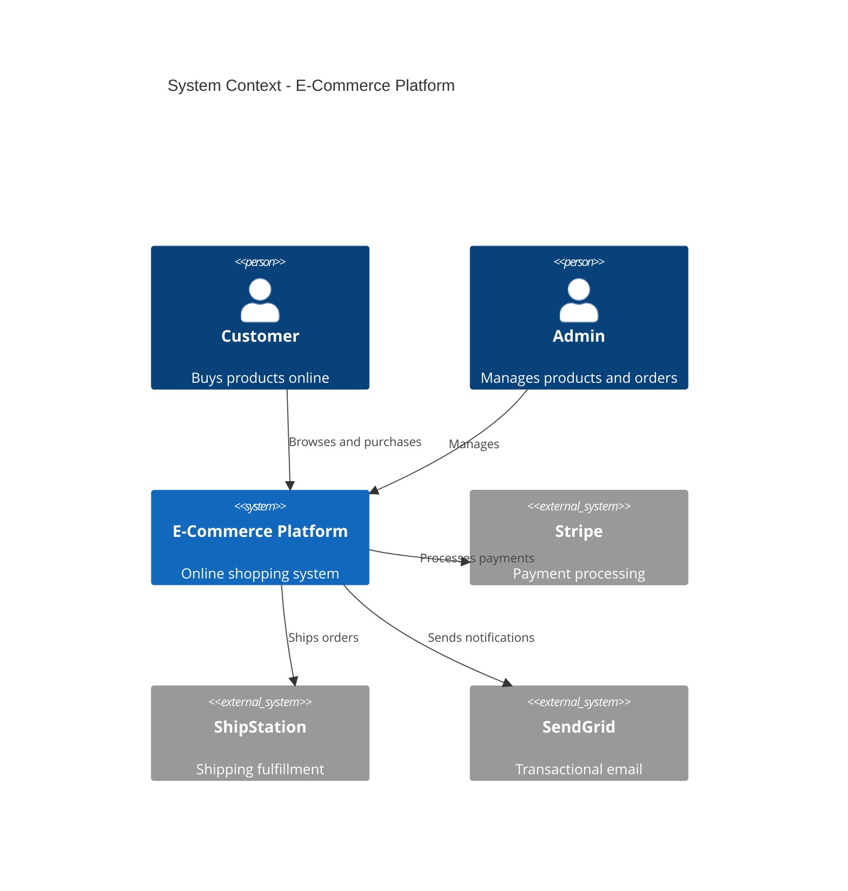

**Level 2 - Container**: Applications and data stores

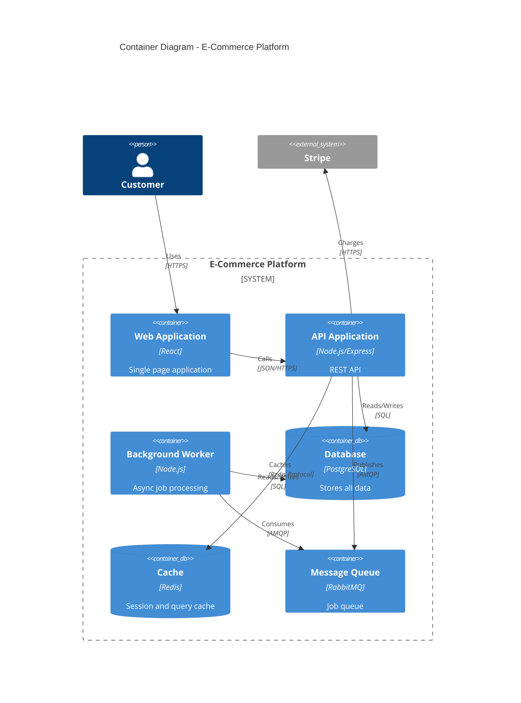

---

## Documentation Patterns

### Pattern 1: The README Architecture Section

```markdown
## Architecture

Our system follows a microservices architecture with an API gateway pattern.

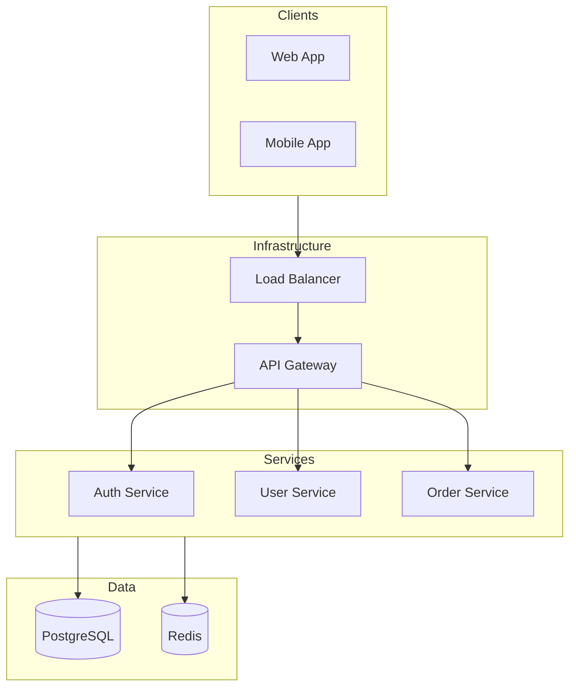

### Key Components

- **API Gateway**: Handles authentication, rate limiting, and request routing
- **Auth Service**: Manages user authentication and JWT tokens
- **User Service**: Handles user profiles and preferences
- **Order Service**: Processes and tracks orders
```

### Pattern 2: API Endpoint Documentation

```markdown
## POST /api/orders

Creates a new order for the authenticated user.

### Request Flow

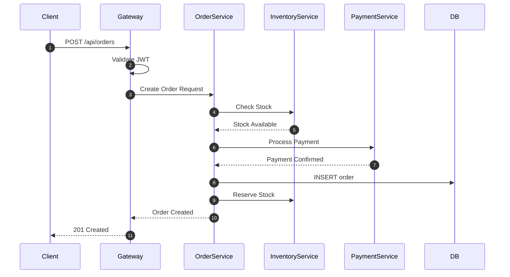

### Request Body

\`\`\`json
{
  "items": [
    { "productId": "prod_123", "quantity": 2 }
  ],
  "shippingAddress": { ... }
}
\`\`\`
```

### Pattern 3: Decision Documentation (ADR)

```markdown
# ADR-001: Use Event-Driven Architecture for Order Processing

## Context

We need to process orders reliably while integrating with external services.

## Decision

We will use event-driven architecture with a message queue.

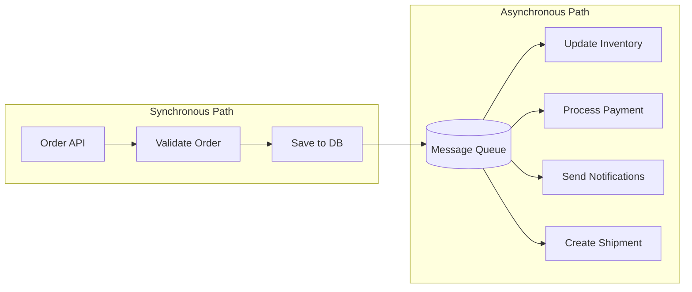

## Consequences

**Positive:**
- Orders are saved immediately (fast response)
- Failures in one service don't block others
- Easy to add new processors

**Negative:**
- Eventual consistency (order status updates are async)
- More complex debugging
```

---

## Step-by-Step Process

### Step 1: Identify Documentation Goals

Ask:
- Who will read this documentation?
- What questions should it answer?
- What decisions should it enable?

### Step 2: Sketch the Structure

Before writing any Mermaid code:
1. List the main concepts/components
2. Identify relationships between them
3. Determine the primary flow

### Step 3: Choose Your Diagrams

Based on your goals:
- Overview/README → Flowchart + C4 Context
- API Documentation → Sequence Diagram
- Data Documentation → ER Diagram
- Process Documentation → Flowchart + State Diagram

### Step 4: Create Iteratively

Start with the simplest diagram that conveys the concept:

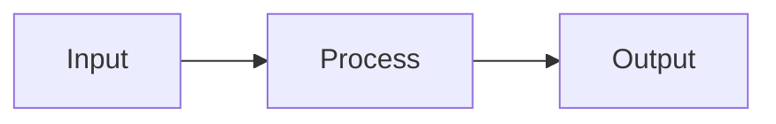

Add detail only where it adds clarity:

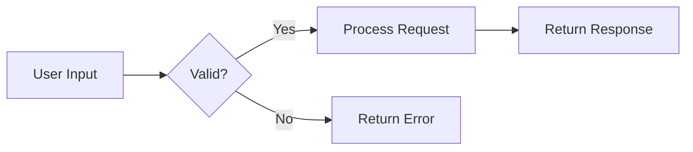

### Step 5: Write Supporting Text

Diagrams should be embedded in explanatory text:

> "The validation flow ensures all requests are properly formatted before processing.
> Invalid requests receive immediate feedback, while valid requests proceed to
> the processing stage."
>
> [DIAGRAM HERE]
>
> "Note that validation happens synchronously at the API gateway level,
> ensuring fast feedback for malformed requests."

### Step 6: Review and Iterate

Check your documentation with fresh eyes:
- [ ] Does the diagram render correctly?
- [ ] Can someone unfamiliar with the system understand it?
- [ ] Is the level of detail appropriate?
- [ ] Does the text add value beyond what's in the diagram?

---

## Common Mistakes to Avoid

### 1. Too Much Detail

**Problem:**
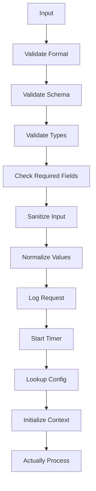

**Solution:** Abstract implementation details

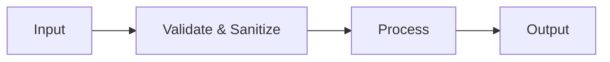

### 2. Ambiguous Arrows

**Problem:** What does this arrow mean?
```
Service A --> Service B
```

**Solution:** Label relationships

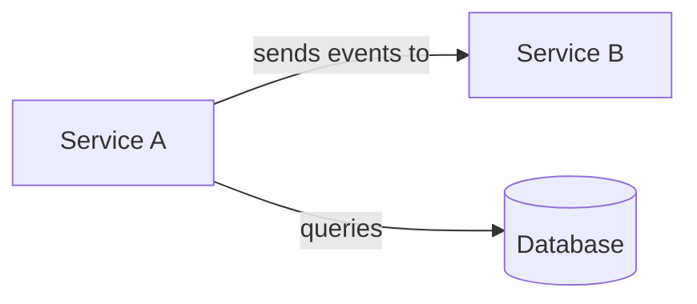

### 3. Inconsistent Abstraction Levels

**Problem:** Mixing high-level and low-level concepts

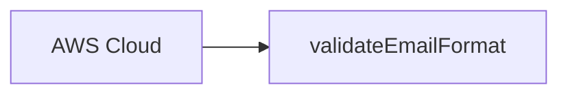

**Solution:** Keep abstraction levels consistent

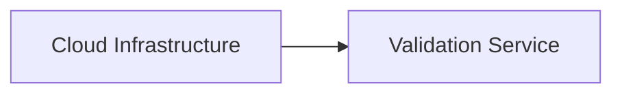

### 4. Diagrams Without Context

**Problem:** Dropping a diagram with no explanation

**Solution:** Always introduce diagrams with context and follow up with insights

---

## Advanced Techniques

### 1. Layered Documentation

Create multiple diagrams at different zoom levels:

**Level 1: Executive Summary**
```mermaid
flowchart LR
    Users --> System --> ExternalServices[External Services]
```

**Level 2: Technical Overview**
```mermaid
flowchart TB
    subgraph Users
        Web
        Mobile
    end
    subgraph System
        API
        Services
        Database
    end
    subgraph External
        Payment
        Email
    end
```

**Level 3: Detailed Component**
```mermaid
sequenceDiagram
    participant API
    participant Auth
    participant Service
    participant DB
    %% ... detailed interaction
```

### 2. Interactive Documentation

Link diagrams together using documentation anchors:

```markdown
See the [Authentication Flow](#authentication-flow) for details on the auth step.
```

### 3. Living Documentation

Keep diagrams close to the code they document:

```
/services
  /auth
    auth-service.ts
    README.md           # Contains auth service diagrams
  /orders
    order-service.ts
    README.md           # Contains order service diagrams
```

### 4. Diagram Generation

For some diagrams, generate Mermaid from code:
- Database schemas → ER diagrams
- API specs → Sequence diagrams
- State machines → State diagrams

---

## Summary

**Making technical documentation simpler with Mermaid:**

1. **Use diagrams as code** - Keep them in version control with your code
2. **Choose the right diagram type** - Match diagram to the question being answered
3. **Layer your documentation** - Overview → Details → Deep Dives
4. **Keep it simple** - Start minimal, add detail only when needed
5. **Provide context** - Diagrams complement text, they don't replace it
6. **Update regularly** - Text docs near code get updated; image docs don't

The goal isn't to create beautiful diagrams—it's to help people understand complex systems quickly and accurately.

---

*This guide is part of the docs-with-mermaid Claude Code skill.*
