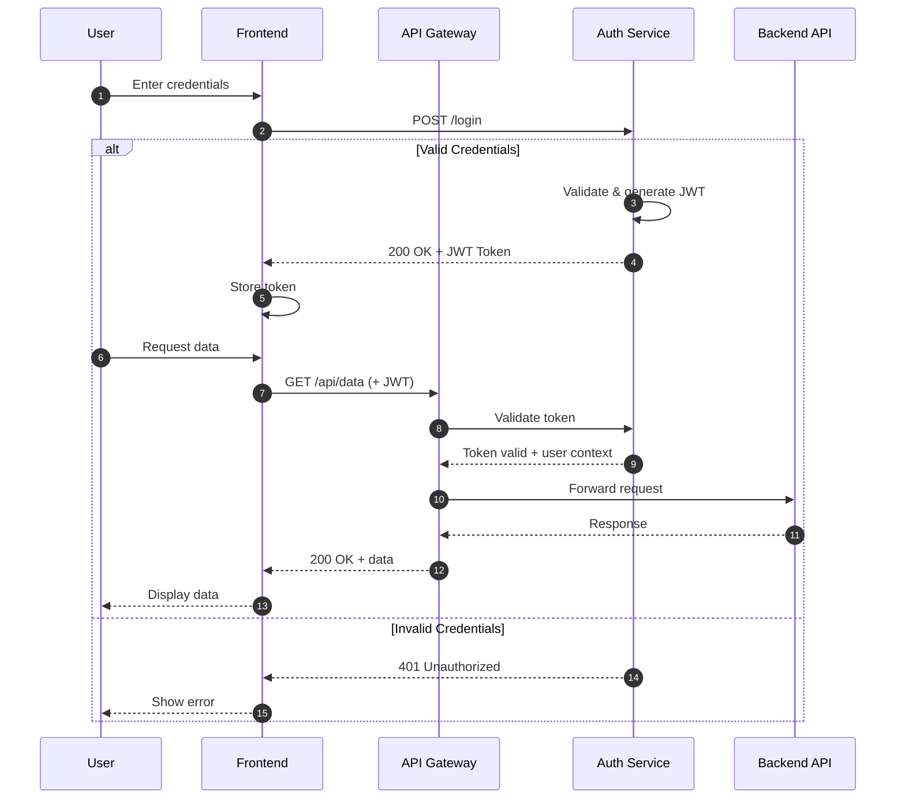
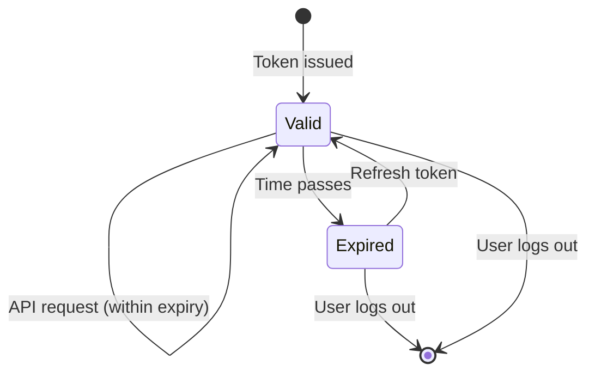

# documentation-skills

A Claude Code skill that transforms walls of text into clear, visual documentation with Mermaid diagrams.

## Install

```bash
npx documentation-skills
```

## Before & After

### Without the Skill

You ask Claude to document your authentication system:

**Authentication System**

- User submits login credentials to the frontend
- Frontend sends credentials to the Auth Service
- Auth Service validates against the database
- If valid, Auth Service generates a JWT token and returns it
- Frontend stores the token in local storage
- For subsequent requests, frontend includes token in Authorization header
- API Gateway extracts and validates the token
- If valid, request is forwarded to backend with user context
- If invalid/expired, returns 401 Unauthorized

**Result:** Correct information, but requires mental effort to visualize the flow.

---

### With the Skill

The same request produces:

## Authentication Flow

The system uses JWT tokens for stateless authentication with the following flow:



### Key Components

| Component | Responsibility |
|-----------|----------------|
| **Frontend** | Stores JWT, attaches to requests |
| **API Gateway** | Validates tokens, routes requests |
| **Auth Service** | Issues tokens, validates credentials |
| **Backend API** | Processes authenticated requests |

### Token Lifecycle



---

**Result:** Visual flow that anyone can understand in seconds.

## What This Skill Does

When installed, Claude learns to:

1. **Choose the right diagram** - Sequence diagrams for API flows, ER diagrams for databases, flowcharts for processes
2. **Structure documentation** - Overview first, then details, with diagrams at each level
3. **Write diagram-friendly prose** - Text that complements visuals, not duplicates them
4. **Use correct Mermaid syntax** - 15+ diagram types with proper formatting

## Supported Diagrams

| Type | Use Case |
|------|----------|
| Sequence | API calls, service interactions |
| Flowchart | Processes, decision trees |
| Class | Object-oriented design |
| ER | Database schemas |
| State | Lifecycles, workflows |
| C4 | Architecture (Context/Container/Component) |
| Gantt | Project timelines |
| Mindmap | Concept hierarchies |

## Usage

After installation, invoke directly:

```
/docs-with-mermaid [topic]
```

Or ask naturally:

```
"Document the payment processing flow"
"Create an architecture diagram for this service"
"Explain how the caching layer works"
```

## Manual Installation

```bash
git clone https://github.com/pranavred/claude-code-documentation-skill.git
cp -r claude-code-documentation-skill/skills/docs-with-mermaid ~/.claude/skills/
```

## Platform Support

Mermaid renders natively on: GitHub, GitLab, Notion, Obsidian, VS Code (with extension), Docusaurus, MkDocs

## Contributing

Open source - contributions welcome:
- Add diagram examples
- Improve templates
- Fix syntax issues

## License

MIT
