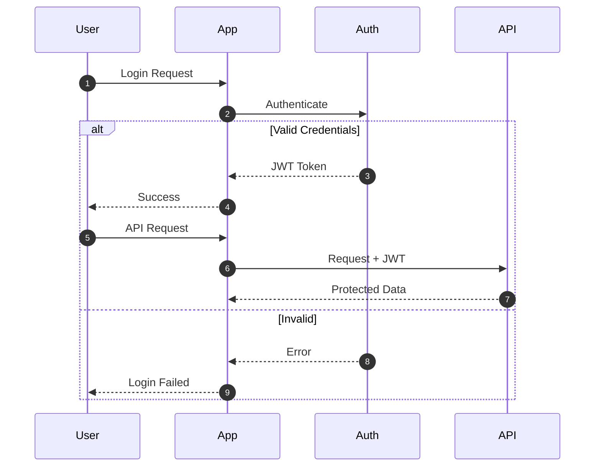

# Technical Documentation with Mermaid Diagrams - Claude Code Skill

A Claude Code skill that enables you to create excellent technical documentation enhanced with Mermaid diagrams. Transform complex systems into clear, visual documentation that anyone can understand.

## What is This?

This is a **Claude Code skill** - a reusable set of instructions that teaches Claude how to create outstanding technical documentation using Mermaid diagrams. When you install this skill, Claude gains expertise in:

- Choosing the right diagram type for any documentation need
- Creating clear, well-structured technical documentation
- Using Mermaid syntax correctly for 15+ diagram types
- Following documentation best practices

## Features

- **15+ Mermaid Diagram Types**: Flowcharts, sequence diagrams, class diagrams, ER diagrams, state machines, C4 architecture diagrams, and more
- **Documentation Templates**: Pre-built patterns for READMEs, API docs, architecture docs, and onboarding guides
- **Best Practices**: Guidelines for creating maintainable, readable documentation
- **Comprehensive Reference**: Complete Mermaid syntax guide included
- **Practical Examples**: Real-world documentation examples you can adapt

## Quick Start

### Installation

1. **Clone this repository** to your machine:

```bash
git clone https://github.com/pranavred/claude-code-documentation-skill.git
```

2. **Copy the skill** to your Claude Code skills directory:

```bash
# For personal skills (available in all projects)
cp -r claude-code-documentation-skill/.claude/skills/docs-with-mermaid ~/.claude/skills/

# OR for project-specific skills
cp -r claude-code-documentation-skill/.claude/skills/docs-with-mermaid /your/project/.claude/skills/
```

3. **Start using it** by invoking `/docs-with-mermaid` in Claude Code or simply asking Claude to create documentation.

### Usage

Once installed, you can:

**Invoke directly:**
```
/docs-with-mermaid my authentication system
```

**Or just ask Claude naturally:**
```
"Document the API flow for user registration"
"Create a README for this repository"
"Explain the architecture of this codebase"
"Draw a diagram showing how the order service works"
```

## What's Included

```
.claude/skills/docs-with-mermaid/
├── SKILL.md              # Main skill instructions
├── mermaid-reference.md  # Complete Mermaid syntax reference
└── examples.md           # Practical documentation examples
```

### SKILL.md

The core skill file that teaches Claude:
- When to use each diagram type
- Documentation structure templates
- Diagram creation guidelines
- Quality checklist for documentation

### mermaid-reference.md

Comprehensive reference covering:
- All 15+ Mermaid diagram types
- Complete syntax for each diagram
- Styling and customization options
- Troubleshooting tips

### examples.md

15 practical examples including:
- API request flow documentation
- System architecture overviews
- Database schema documentation
- CI/CD pipeline documentation
- Authentication flow diagrams
- And much more...

## Supported Diagram Types

| Diagram | Best For |
|---------|----------|
| **Flowchart** | Processes, decisions, algorithms |
| **Sequence** | API calls, service interactions |
| **Class** | Object-oriented design |
| **State** | Lifecycle, state machines |
| **ER** | Database schemas |
| **C4 Context** | High-level architecture |
| **C4 Container** | Application architecture |
| **C4 Component** | Component internals |
| **User Journey** | UX documentation |
| **Gantt** | Project timelines |
| **Pie Chart** | Proportions |
| **Mindmap** | Hierarchical concepts |
| **Timeline** | Historical events |
| **Git Graph** | Branching strategies |
| **Quadrant** | Prioritization matrices |

## Example Output

When you ask Claude to document an authentication flow, you might get:

````markdown
## Authentication Flow

The authentication system uses JWT tokens with OAuth2 for secure access.



The flow begins when a user submits credentials...
````

## Platform Compatibility

Mermaid diagrams render natively in:

| Platform | Support |
|----------|---------|
| GitHub | Markdown files, comments, READMEs |
| GitLab | Markdown files, wikis |
| Notion | Code blocks (`mermaid` language) |
| Obsidian | Native support |
| VS Code | Markdown Preview Enhanced extension |
| Confluence | Mermaid plugin |
| Docusaurus | Native support |
| MkDocs | mermaid2 plugin |

## Customization

### Adjusting the Skill

You can modify `SKILL.md` to:
- Add company-specific documentation standards
- Include custom diagram templates
- Adjust the documentation structure

### Adding Examples

Add your own examples to `examples.md` for domain-specific patterns.

## Contributing

Contributions are welcome! Feel free to:
- Add new diagram examples
- Improve documentation templates
- Fix syntax errors
- Add support for new Mermaid features

## Resources

- [Mermaid Official Documentation](https://mermaid.js.org/)
- [Mermaid Live Editor](https://mermaid.live/) - Test your diagrams
- [Claude Code Documentation](https://docs.anthropic.com/claude-code)

## License

MIT License - See [LICENSE](LICENSE) for details.

---

**Transform your documentation from walls of text into clear, visual guides that everyone can understand.**
